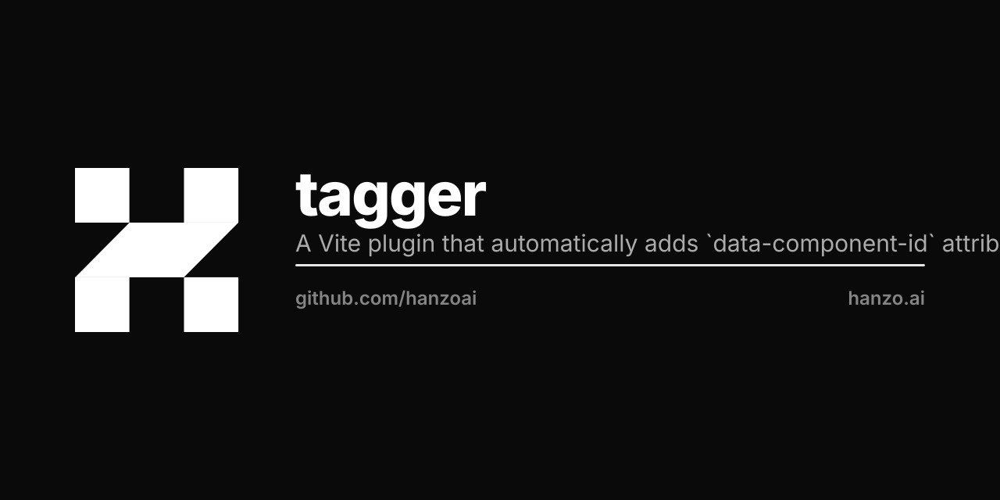

<p align="center"></p>

# Vite Plugin Component Tagger

A Vite plugin that automatically adds `data-component-id` attributes to JSX/TSX components for easier debugging and tracking.

## Installation

```bash
npm install @test/plugin
```
